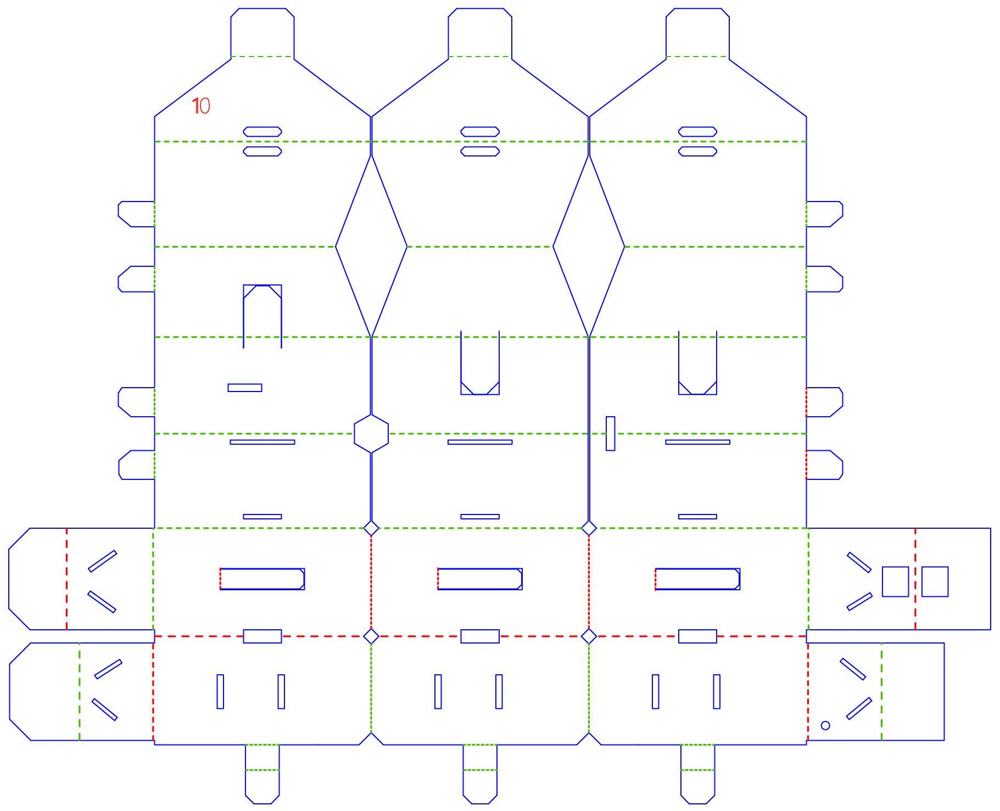
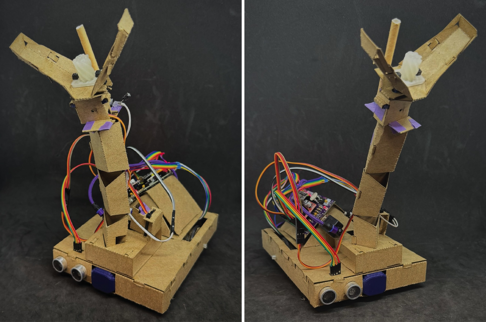

# Lab 4

## Objectives

The objective of this laboratory assignment is to further develop the skills required to build assemblies from laser-cut components and construct a functional differential-drive robot chassis. A grasping arm will be added to the MSEbot chassis and the robot will be programmed to perform a multipart task. By the end of the lab each student should:

1. Learn additional construction techniques for building assemblies from laser-cut components
2. Understand how to program a sequence of operations
3. Be able to control the motion of a simple robotic arm using RC servo motors
4. Further develop real-time programming skills

### Hardware Required

For this lab, you will require the MSEbot chassis that was assembled in Lab 3, along with other components found in the MSE 2202 Lab Kit. These include:

* 3D-printed leadscrew and nut
* Hex standoff
* RC servo motor ⨉ 2
* 4" zip tie ⨉ 5
* 8" zip tie ⨉ 2
* IR receiver assembled in Lab 1
* IR LED assembled in Lab 1
* Paper straw
* Masking tape
* Gecko sticky dot
* Ping pong ball
* Magnet
* Jumper or Dupont wires (M–F and F–F)
* Rechargeable USB battery ⨉ 2
* USB-A male mag cable with micro-USB male magnetic end
* USB-A male mag cable with USB-C magnetic end

### Equipment

In addition to the components contained in the Lab Kit, the following equipment is available in ACEB 3435 for the purpose of conducting this laboratory:

* Needle-nose pliers
* Flush cutters
* Slot screwdriver
* Hot glue gun
* Agilent Technologies U3401A multimeter
* Rigol MSO1074 4 Channel 70 MHz oscilloscope
* PC with Arduino IDE

## MSEbot Assembly

Assembly instructions to complete the MSEbot are listed below. The video walks through the assembly process with live-action tips and demonstrations. For this reason, it recommended that the video be watched far enough ahead to ensure that all of the relevant information and guidance has been viewed for each step.

The build steps for the complete MSEbot are listed below. The fold directions for each component are indicated by the dashed lines. The red, longer-dashed lines indicate a *valley* fold—the paper is folded forward onto itself to form a crease at the bottom (forms a "V" when you unfold). The green shorter-dashed lines indicate a *mountain* fold—the paper is folded behind itself to form a crease at the top (like a mountain peak when you unfold). Mountain folds are often made by flipping over the paper before folding in the same manner as a valley fold. Dotted lines indicate folds that are not scored/marked.

1. [[00:03]](https://www.youtube.com/watch?v=BLxwdLLLQJw&t=3s) Overview of MSEbot components
2. [[00:48]](https://www.youtube.com/watch?v=BLxwdLLLQJw&&t=48s) Attaching hex standoff to claw
3. [[02:27]](https://www.youtube.com/watch?v=BLxwdLLLQJw&t=147s) Leadscrew and nut preparation
4. [[02:51]](https://www.youtube.com/watch?v=BLxwdLLLQJw&t=171s) Folding Component 8 (claw)  
 

5. [[11:47]](https://www.youtube.com/watch?v=BLxwdLLLQJw&t=707s) Plug in hot glue gun
6. [[11:54]](https://www.youtube.com/watch?v=BLxwdLLLQJw&t=714s) Folding Component 8 continued
7. [[16:24]](https://www.youtube.com/watch?v=BLxwdLLLQJw&t=984s) Folding Component 9  
 

8. [[18:19]](https://www.youtube.com/watch?v=BLxwdLLLQJw&t=1099s) Integrating RC servo into claw
9. [[21:33]](https://www.youtube.com/watch?v=BLxwdLLLQJw&t=1293s) Install paper washer
10. [[22:35]](https://www.youtube.com/watch?v=BLxwdLLLQJw&t=1311s) Gluing lead screw to hex standoff
11. [[23:09]](https://www.youtube.com/watch?v=BLxwdLLLQJw&t=1355s) Connecting leadscrew nut to claw
12. [[26:05]](https://www.youtube.com/watch?v=zBLxwdLLLQJw&t=1565s) Folding Component 10 (arm)  
 

13. [[31:56]](https://www.youtube.com/watch?v=BLxwdLLLQJw&t=1916s) Joining claw to arm
14. [[35:27]](https://www.youtube.com/watch?v=BLxwdLLLQJw&t=2127s) Integrating IR receiver module into claw/arm
15. [[37:48]](https://www.youtube.com/watch?v=zBLxwdLLLQJw&t=2268s) Passing servo and IR receiver wires through arm
16. [[39:24]](https://www.youtube.com/watch?v=BLxwdLLLQJw&t=2364s) Chassis disassembly
17. [[40:36]](https://www.youtube.com/watch?v=BLxwdLLLQJw4&t=2436s) Folding Component 11  
 

18. [[44:57]](https://www.youtube.com/watch?v=BLxwdLLLQJw&t=2697s) Joining arm to Component 11
19. [[50:17]](https://www.youtube.com/watch?v=BLxwdLLLQJw&t=3017s) Connecting arm to top of chassis
20. [[51:28]](https://www.youtube.com/watch?v=zBLxwdLLLQJw&t=3088s) Integrating arm RC servo into chassis
21. [[57:58]](https://www.youtube.com/watch?v=BLxwdLLLQJw&t=3478s) Connecting arm RC servo to arm
22. [[59:35]](https://www.youtube.com/watch?v=BLxwdLLLQJw&t=3575s) Chassis reassembly
23. [[60:45]](https://www.youtube.com/watch?v=BLxwdLLLQJw&t=3645s) Arm RC servo wiring
24. [[60:57]](https://www.youtube.com/watch?v=BLxwdLLLQJw&t=3657s) Claw RC servo wiring
25. [[61:30]](https://www.youtube.com/watch?v=BLxwdLLLQJw&t=3690s) IR Receiver wiring

The electrical connections are as follows:

The assembled MSEbot should resemble the one shown below:

## Ping Pong Ball Beacon Assembly

The IR LED that was soldered in [Lab 1](https://github.com/MSE2202/Lab1/blob/main/docs/IR-LED-assembly.md) will be integrated into a simple stand that will irradiate a ping pong ball, allowing it to be localized by the MSEbot. The complete build is demonstrated in the following video.

1. [[00:03]](https://www.youtube.com/watch?v=zOysJRRE8V4&t=3s) Overview of beacon components
2. [[00:38]](https://www.youtube.com/watch?v=zOysJRRE8V4&&t=38s) Folding Component 12  
 

3. [[01:43]](https://www.youtube.com/watch?v=zOysJRRE8V4&t=103s) Inserting IR LED
4. [[02:31]](https://www.youtube.com/watch?v=zOysJRRE8V4&t=151s) Gluing magnet to ping pong ball
5. [[03:11]](https://www.youtube.com/watch?v=zOysJRRE8V4&t=191s) Soldering headers to ESP32-C3 module
6. [[03:33]](https://www.youtube.com/watch?v=zOysJRRE8V4&t=213s) Attaching Hall effect sensor
7. [[05:10]](https://www.youtube.com/watch?v=zOysJRRE8V4&t=310s) Connecting components to ESP32-C3
8. [[07:09]](https://www.youtube.com/watch?v=zOysJRRE8V4&t=429s) Testing

## Code

### MSEbot

During the build process, test code must be loaded onto the MSEduino. The code used for Laboratory 4 is an updated version of the sketch used for Laboratory 3. You can clone this repository, which contains the MSEbot base code in the [Lab4](Lab4) folder.

As a reminder, the code assumes that all of the DIP switches, except for S1-2, are in the on position. This will enable the Smart LED (S1-4) and potentiometer (S1-3). SW0 (S1-1) serves to enable/disable and disable the motors (i.e., the motors will not turn when off). The potentiometer controls the speed of the motors in drive mode. Note that if the pot is rotated fully clockwise, the motor speed will be very slow; rotate counterclockwise to increase the motor speed.

* **Mode 0**—Robot is stopped. The mode indicator glows red. This mode is the default on power up or reset.
* **Mode 1**—Normal run mode. The mode indicator glows green. This mode is selected by pressing the Mode button once. There is a 5 second delay before the motor control code is executed. The pot controls the speed of the motor. The test code repeats a forward, reverse, turn left, turn right, stop sequence.
* **Mode 2**—Test ultrasonic sensors. The mode indicator glows blue. This mode is selected by pressing the Mode button twice. The measured distances are printed to the serial monitor.
* **Mode 3**—Test IR receiver. The mode indicator glows yellow. This mode is selected by pressing the Mode button three times. Any received characters are printed to the serial monitor.
* **Mode 4**—Test claw servo. The mode indicator glows cyan. This mode is selected by pressing the Mode button four times. The potentiometer controls the position of the RC servo used to open and close the claw. Note that default the range of the claw servo may need to be adjusted for your robot.
* **Mode 5**—Test arm servo. The mode indicator glows magenta. This mode is selected by pressing the Mode button five times. The potentiometer controls the position of the RC servo used to extend and retract the arm.
Note that default the range of the arm servo may need to be adjusted for your robot.

In all modes you can also connect your MSEbot to a computer and use the serial monitor to observe the debugging messages.

### IR Beacon

The ESP32-C3 in the IR beacon must be programmed to make the beacon operational. The code for the IR beacon is hosted in a separate repository on GitHub. It may be found at [https://github.com/MSE2202/C3-Beacon](https://github.com/MSE2202/C3-Beacon). You can download (or clone) the entire repository or only the sketch in the C3-Beacon folder. Programming instructions are provied in the C3-Beacon repository.

The beacon can be tested using Mode 3 of the MSEbot code, described above.

## Exercise

Create a new branch **exercise** and switch to it. Modify the MSEbot basecode so that after pushing PB1, your MSEbot autonomously follows the path illustrated below to find and collect a ping pong ball irradiated with an IR signal.

Each block in the path is a standard 8.5" ⨉ 11" sheet of paper. To keep the paper from catching the Chicago bolts on the bottom of the MSEbot, the sheets should be taped together along the full edge length. The beacon should be *at least* one paper length from the edge of the third sheet, as indicated by the dotted line. The stages of the task are as follows:

1. Drive forward across the first two sheets of paper
2. Turn 90º counterclockwise
3. Drive forward across the third sheet of paper
4. Stop forward motion and use the IR detector in combination with adjustments of the arm height and/or rotation of the chassis to localize the ping pong ball
5. Drive forward and grab ping pong ball with the claw. The ultrasonic sensor should be used to prevent crashing into the beacon
6. Return to the start position, drop the ball, and leave drive mode

At all times, the robot must stay within the sheets of paper. If all goes well, your MSEbot should stop in roughly the same place that it started from with the ping pong ball within the claw, before dropping it. Show your working MSEbot to a TA. If you have not done so already, be sure to __*push your respository back to GitHub*__.  __**Failure to do so will result in a grade of 0 for the lab.**__

### Other Things to Explore

1. Extend the path with additional sheets of paper.
2. Add a "T" section to the path at which the robot must find the IR beacon to decide whether to turn right or left.
3. Use a PID-based drive system to improve the drive accuracy.

## Resources

* [Arduino Language Reference](https://www.arduino.cc/reference/en/)
* [Arduino-ESP32 GPIO API](https://docs.espressif.com/projects/arduino-esp32/en/latest/api/gpio.html)
* [GPIO Peripheral Reference](https://docs.espressif.com/projects/esp-idf/en/latest/esp32/api-reference/peripherals/gpio.html)
* [Arduino-ESP32 LEDC API](https://docs.espressif.com/projects/arduino-esp32/en/latest/api/ledc.html)
* [LEDC Peripheral Reference](https://docs.espressif.com/projects/esp-idf/en/latest/esp32/api-reference/peripherals/ledc.html)
* [SG90 RC Servo Motor Data Sheet](http://www.ee.ic.ac.uk/pcheung/teaching/DE1_EE/stores/sg90_datasheet.pdf)
* [G12-N20-100 Geared Mini DC Motor](https://www.handsontec.com/dataspecs/motor_fan/GA12-N20.pdf)
* [G12-N20-100 Specifications](docs/GA12-N20_specs.png)
* [MX1508 Dual DC Motor Driver](https://components101.com/modules/mx1508-dc-motor-driver-pinout-features-datasheet)
* [HC-SR04 Ultrasonic Sensor Module](https://cdn.sparkfun.com/datasheets/Sensors/Proximity/HCSR04.pdf)
* [IR LED Data Sheet](https://www.we-online.com/components/products/datasheet/15400594A3590.pdf)
* [TSOP32238 IR Receiver Data Sheet](https://www.vishay.com/docs/82489/tsop322.pdf)

## Evaluation

Note that to avoid confusion with a colleague's MSEbot, a clear identifying mark (e.g., your name) must be made on your MSEduino and MSEbot. **Robots without distinct marks will not be graded.**

| Task                                     | Maximum Marks | Demo | Code | Comments |
|:-----------------------------------------|:-------------:|:----:|:----:|:--------:|
| MSEbot arm built correctly               | **20**        | 20   | —    | —        |
| Complete MSEbot operational              | **15**        | 15   | —    | —        |
| Robot can navigate path forwards         | **15**        | 8    | 5    | 2        |
| Robot can localize beacon                | **20**        | 12   | 6    | 2        |
| Robot can pick up ping pong ball         | **15**        | 8    | 5    | 2        |
| Robot can reverse to start and drop ball | **15**        | 8    | 5    | 2        |
